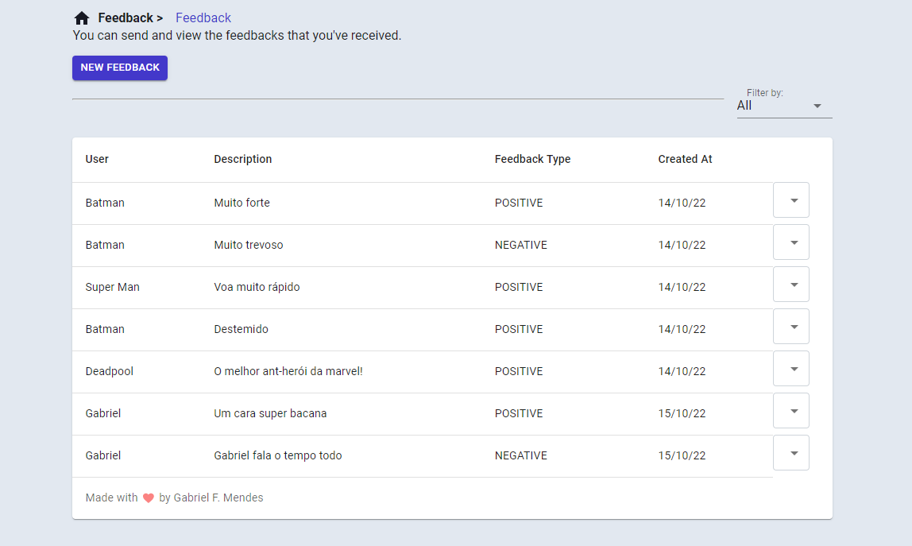
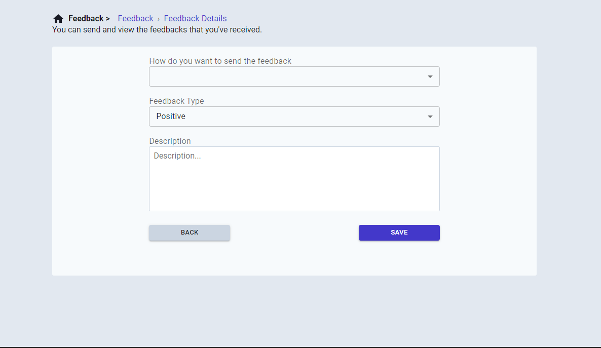

<h1 align="center">
   HapRocket - The best feedback app on the planet.
</h1>

<p align="center">
  <a href="#about">About</a> •
  <a href="#features">Features</a> •
  <a href="#instalation-guide">Instalation guide</a> •
  <a href="#technologies">Technologies</a>
</p>

## About

A WEB APP to send feedback to other people. 🚀🚀

<strong> You can test and check the haprocket in production mode clicking by [here](https://haprocket.vercel.app) </strong>

---

## Features

- [x] Create a feedback
- [x] View feedbacks
- [x] Delete feedbacks

---

## Technologies
- [Vite](https://vitejs.dev/)
- [Emotion](https://emotion.sh/)
- [Typescript](https://www.typescriptlang.org/)
- [Material UI](https://mui.com/)
- [React Router Dom](https://reactrouter.com/)

---

### Instalation guide:

#### 1. Download the project with git:
```
https://github.com/gabrielbugarelli/haprocket-frontend.git
```

#### 2. Download Yarn with NPM:
```
npm install --global yarn
```

#### 3. install the dependencies:
```
yarn install
```

#### 4. Run the application
```
yarn dev
```
### After that, the project will be raised on http://127.0.0.1:5173/

#### 5. Configure variables
insert environment variable <strong>VITE_BASE_URL_API</strong> pointing to API address


<h3>WARNING!!!!</h3>

<strong> You can download the api and configure it by going to the following [here](https://github.com/gabrielbugarelli/haprocket-api) </strong>

---
 
<div align="center"> 
	
</div>

<div align="center"> 
	
</div>
